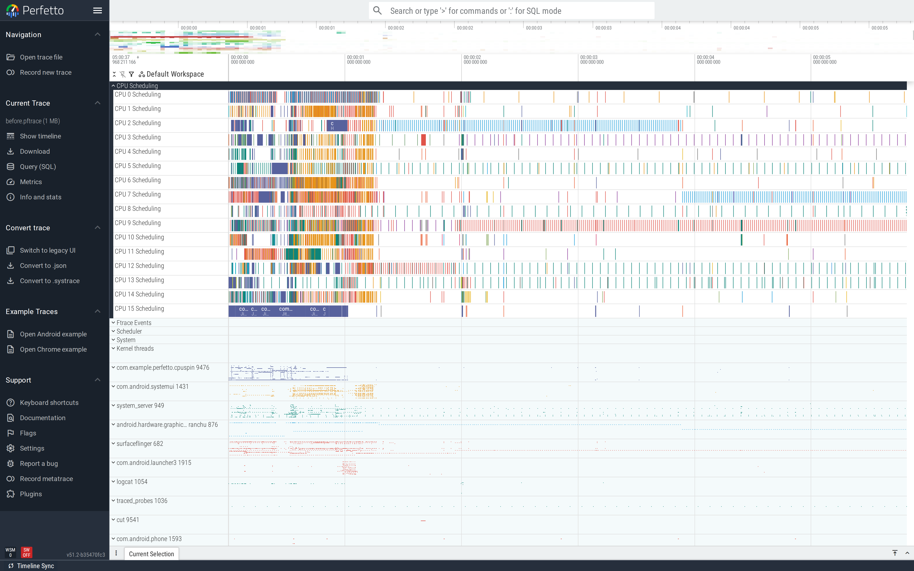
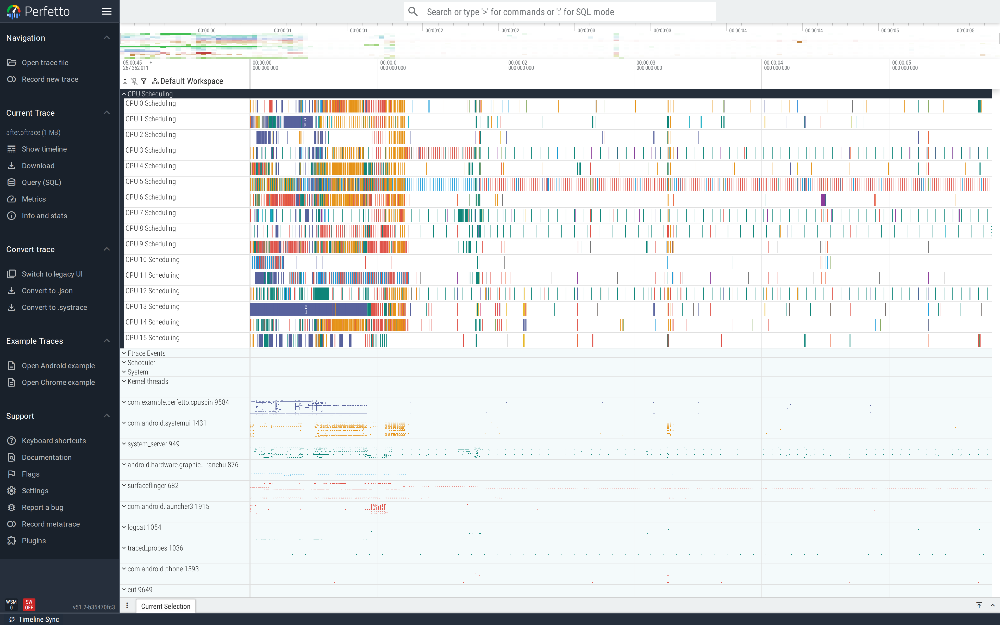

# CPU spinning

A hot method that runs for hundreds of milliseconds at 100% CPU
on one core is wasted battery and, if it's on the UI thread,
visible jank. The trace gives you two things to look at: the
sched track (the thread is `Running` continuously) and a
callstack flamegraph rooted at the hot method.

This is part of the
[Android performance tutorials](perf-tutorial-series.md) series.

## Capture

```
ftrace_events: "sched/sched_switch"
ftrace_events: "sched/sched_waking"
ftrace_events: "power/cpu_frequency"
atrace_categories: "sched"
atrace_apps: "com.example.perfetto.cpuspin"
```

For a callstack flamegraph on the spinning thread, layer in the
`linux.perf` data source (or use
[simpleperf](https://developer.android.com/ndk/guides/simpleperf-intro)
out-of-band). The atrace section markers in the demo
(`Trace.beginSection("parseQuadratic")`) give you the slice
boundary; sampled callstacks underneath give you the body.

Full config:
[`trace-configs/cpuspin.cfg`](https://github.com/fiveapplesonthetable/perfetto/tree/perf-tutorials-artifacts/cpu-spin/trace-configs/cpuspin.cfg).

## Case study: O(n²) "parser"

A hand-rolled key=value parser takes a string and pulls each
comma-separated pair out using `substring`:

```java
while (s.length() > 0) {
    int comma = s.indexOf(',');
    if (comma < 0) break;
    String pair = s.substring(0, comma);          // alloc
    if (pair.indexOf('=') > 0) count++;
    s = s.substring(comma + 1);                    // alloc + copy
}
```

`s.substring(comma + 1)` makes a fresh `String` of the rest of
the input every iteration — O(n) per step, O(n²) overall.

### Read the trace top-down

The CpuSpinDemo process expanded shows the parser running on a
dedicated `Parser` thread. That thread is `Running` (green sched
state) for the entire `parseQuadratic` slice. The CPU sched
tracks above show one core pegged at 100%; other cores are mostly
idle. This is the textbook "compute-bound on one thread" shape:



The wider context matters because *what's on the rest of the
machine* tells you whether parallelising would help. Here the
other cores are idle — parallelising would help. If they were
busy, the bottleneck would already be elsewhere.

### Find it

```sql
SELECT name, COUNT(*) AS n, AVG(dur)/1e6 AS avg_ms
FROM slice WHERE name LIKE 'parse%' GROUP BY name;
```

Before-trace: **parseQuadratic, 10 calls, 44.3 ms each** for a
2,000-pair input. In the UI the worker thread track shows
`Running` for the entire slice; the GC track is busy in parallel
(those substrings are pure garbage).


### Fix

Index-based scan; never allocate a substring:

```java
int count = 0, start = 0, len = s.length();
for (int i = 0; i < len; i++) {
    if (s.charAt(i) != ',') continue;
    for (int j = start; j < i; j++) {
        if (s.charAt(j) == '=') { count++; break; }
    }
    start = i + 1;
}
return count;
```

### Verify

After-trace: **parseLinear, 10 calls, 26.6 ms each** — 1.7×
faster on this input, with the gap widening as input grows. The
GC track goes quiet because the per-iteration allocations are
gone.


Wide view: same Parser thread, narrower Running stretches per
parse, GC daemon track quiet. The CPU core that was pinned is
now bursty rather than constant:



For a flamegraph rooted at the parser to attribute the cost
*within* the slice, layer in `linux.perf` callstack sampling on
the same trace config. The flamegraph then shows which lines of
the parse loop the thread spends its time in — on the buggy
version it's `String.substring`; on the fixed one it's evenly
distributed across `charAt`.

## Second pattern: layout measure pass that's O(n²)

A deeply nested view tree where each parent re-measures every
child on every pass produces the same slice-shape: one method
dominating the flamegraph, one thread pegged. Different fix —
flatten the layout, switch to `ConstraintLayout`, or memoise the
measure results.

## See also

- [Frame jank](frame-jank.md) — when the spinning thread is the
  UI thread.
- Repro artifacts:
  <https://github.com/fiveapplesonthetable/perfetto/tree/perf-tutorials-artifacts/cpu-spin>
