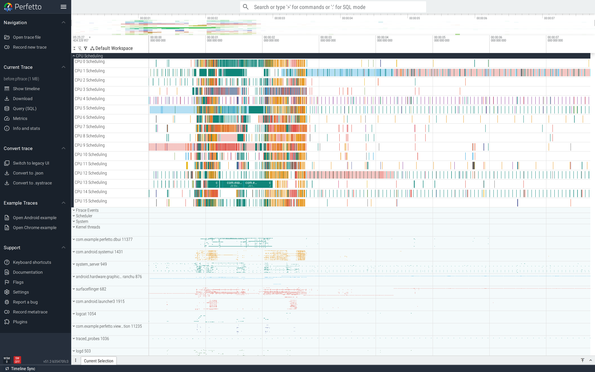
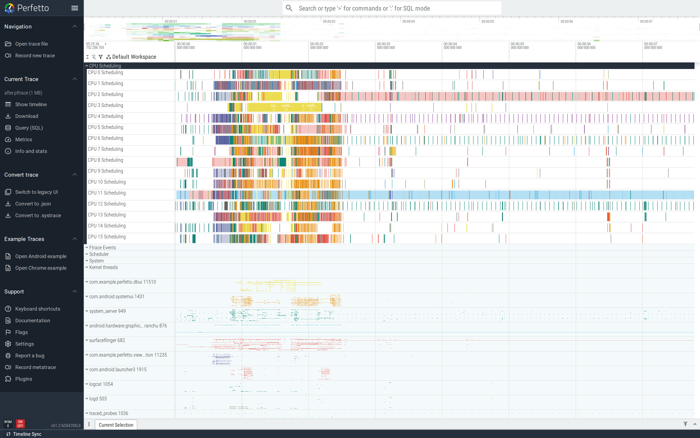

# Database query on the UI thread

Opening a SQLite database does disk I/O. Running a query that
touches many rows does CPU work plus more I/O. Doing either on
the UI thread blocks the launcher's first frame on a cold start
and freezes the UI on every subsequent open.

This is part of the
[Android performance tutorials](perf-tutorial-series.md) series.

## Capture

```
ftrace_events: "sched/sched_switch"
ftrace_events: "sched/sched_blocked_reason"
ftrace_events: "f2fs/f2fs_sync_file_enter"
ftrace_events: "f2fs/f2fs_sync_file_exit"
atrace_categories: "view"
atrace_categories: "sched"
atrace_categories: "binder_driver"
atrace_apps: "com.example.perfetto.dbui"
```

The `f2fs` events surface the kernel-side disk waits on the main
thread. Pair with the `frametimeline` data source to correlate
with frame-level outcomes.

Full config:
[`trace-configs/dbui.cfg`](https://github.com/fiveapplesonthetable/perfetto/tree/perf-tutorials-artifacts/db-ui-thread/trace-configs/dbui.cfg).

## Case study: open + query inside `onCreate`

The Activity opens the database, seeds it, and runs a heavy
query before `setContentView` returns:

```java
SeedHelper h = new SeedHelper(this);
SQLiteDatabase db = h.getWritableDatabase();           // disk open
seedIfEmpty(db, 5000);                                  // bulk insert (one-time)
try (Cursor c = db.rawQuery(
        "SELECT COUNT(DISTINCT category) FROM items WHERE name LIKE ?",
        new String[] {"%a%"})) {                       // full table scan
    if (c.moveToFirst()) t.setText("categories: " + c.getInt(0));
}
```

### Read the trace top-down

The DbUiDemo process expanded shows the main thread carrying a
single big `openAndQueryOnUiThread` slice. Inside it, sched
states alternate Running and Uninterruptible Sleep — the latter
is the kernel-side disk wait. The Frame Timeline tracks below
have no Actual frame slices for the entire duration, because the
launcher activity hasn't gotten to its first frame yet:



The "Frame Timeline empty" signal is the user-facing one: this
isn't just slow code, it's a visible freeze before the screen
appears.

### Find it

```sql
SELECT name||' ms:'||(AVG(dur)/1e6)
FROM slice WHERE name LIKE 'openAndQuery%' GROUP BY name;
```

Before-trace: **openAndQueryOnUiThread, 328 ms — on the main
thread.** The launcher activity can't render its first frame
until this returns.


### Fix

Move open+query off the UI thread. Post the result back to the UI
thread when ready:

```java
HandlerThread bg = new HandlerThread("Db"); bg.start();
new Handler(bg.getLooper()).post(() -> {
    SQLiteDatabase db = h.getWritableDatabase();
    seedIfEmpty(db, 5000);
    int categories;
    try (Cursor c = db.rawQuery(...)) {
        categories = c.moveToFirst() ? c.getInt(0) : 0;
    }
    final int cats = categories;
    new Handler(Looper.getMainLooper()).post(() -> t.setText("categories: " + cats));
});
```

Real apps should use Room (which exposes coroutine `suspend`
methods and Flow) — not raw SQLite — for everything except the
simplest schemas.

### Verify

After-trace: **openAndQueryOffMainThread, 386 ms — but on the
"Db" background thread.** The total work is similar (slightly
larger because of the off-thread hop), but the UI thread is free
to render the activity's first frame immediately.


Wide view: a new `Db` worker thread carries the open+query work;
the main thread is short and free; the Frame Timeline starts
producing Actual frames immediately:



The fix is structurally identical for any synchronous I/O pattern
on the UI thread —
[main-thread I/O](main-thread-io.md) and this tutorial both come
down to "post the work, post the result back". Room codifies
this with `suspend` DAO methods; if you're not using Room, the
`HandlerThread` + `runOnUiThread` snippet above is the bare
minimum.

## Second pattern: synchronous Room query

A Room DAO call without `suspend`/coroutine wrapping has the
same shape — main thread in `D` state inside a Room slice during
an `onResume`-triggered fetch. Fix: declare the DAO method
`suspend` and call it from `lifecycleScope`.

## See also

- [App startup](app-startup.md) — DB open inside `Application.onCreate`
  is a startup-time bug as much as a jank bug.
- [Main-thread I/O](main-thread-io.md) — for the same shape
  triggered by SharedPreferences.
- Repro artifacts:
  <https://github.com/fiveapplesonthetable/perfetto/tree/perf-tutorials-artifacts/db-ui-thread>
