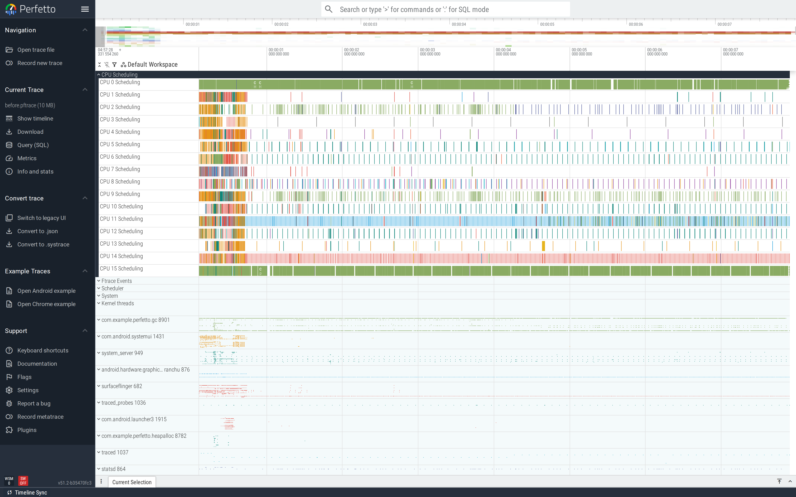
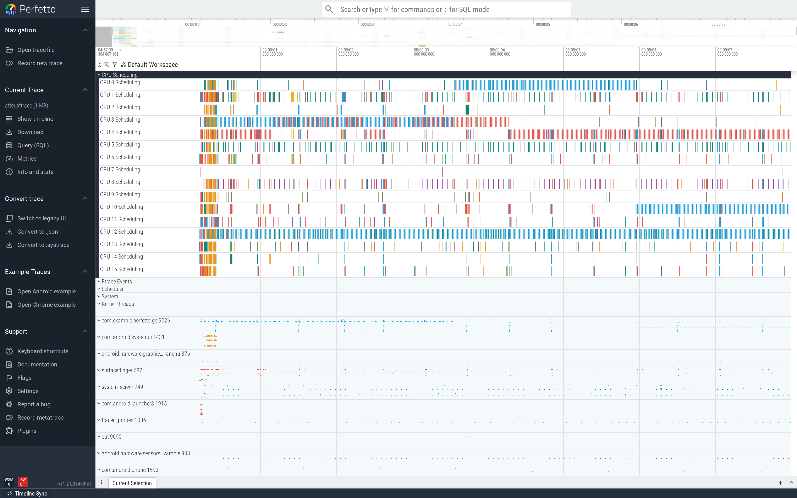

# GC pauses

When an allocation pattern keeps the GC busy, the GC thread
competes for CPU with the UI thread and ART's stop-the-world
points pause every running thread. Both effects show up in the
trace as red frames and visible `Background concurrent mark
compact GC` slices.

This is part of the
[Android performance tutorials](perf-tutorial-series.md) series.

## Capture

```
atrace_categories: "dalvik"  "view"  "sched"
atrace_apps: "com.example.perfetto.gc"

data_sources: { config { name: "android.surfaceflinger.frametimeline" } }
```

`dalvik` is what surfaces ART's GC slices. The frametimeline data
source pairs the GC pressure with frame outcomes so you can see
the consequence.

Full config:
[`trace-configs/gc.cfg`](https://github.com/fiveapplesonthetable/perfetto/tree/perf-tutorials-artifacts/gc-pauses/trace-configs/gc.cfg).

## Case study: `String + char` in a hot loop

Every 16 ms the demo builds a 10,003-character string by
concatenation:

```java
String s = "log";
for (int i = 0; i < 10000; i++) {
    s = s + (char) ('A' + (i % 26));   // each + allocates a new String
}
```

10,000 short-lived `String`s per call, called 60 times per second.
ART's allocator and GC quietly burn through the budget.

### Read the trace top-down

The GcDemo process expanded shows the main thread doing
`buildLogLine` work, plus a *constantly-busy* `Heap thread pool
worker`. The GC thread track is essentially never idle —
`Background concurrent mark compact GC` slices run back-to-back
for the entire trace:



That density is the difference between a high-allocation app
(where the GC kicks in occasionally) and a *broken* one (where
the GC can't keep up with the allocator and runs continuously).

### Find it

```sql
SELECT 'avg_ms:'||(AVG(dur)/1e6)||' count:'||COUNT(*)
FROM slice WHERE name='buildLogLine';
SELECT name, COUNT(*) FROM slice
WHERE name LIKE '%GC%' AND name NOT LIKE '%Manager%'
  AND track_id IN (SELECT id FROM thread_track WHERE utid IN
      (SELECT utid FROM thread WHERE upid =
          (SELECT upid FROM process WHERE name='com.example.perfetto.gc')))
GROUP BY name;
```

Before-trace: **30 buildLogLine calls, 236.9 ms each (!), 259 GC
slices** (`Background concurrent mark compact GC` and
`Background young concurrent mark compact GC`). The hot loop is
generating so much garbage that the GC thread is permanently
busy.


### Fix

One reusable `StringBuilder`. Same logic, no per-character
allocation:

```java
private final StringBuilder sb = new StringBuilder(10003);

sb.setLength(0);
sb.append("log");
for (int i = 0; i < 10000; i++) {
    sb.append((char) ('A' + (i % 26)));
}
```

### Verify

After-trace: **449 buildLogLine calls, 0.80 ms each, 0 GC
slices** in the captured 6 s window. **295× faster per call,
15× more throughput, and the GC stops running entirely.**


Wide view confirms the GC thread is empty across the whole
trace; the main thread is running `buildLogLine` ~15× more often,
each call 295× faster:



The lesson generalises beyond `String + char`: any per-iteration
allocation in a hot loop will produce this trace shape on a
device under enough load. Watch the `Heap thread pool worker`
density as a coarse health metric — a healthy app has
gaps between collections; a sick one looks like the buggy
trace above.

## Second pattern: autoboxing pressure

Boxing an `int` into `Integer` in a hot loop has the same shape
in the trace — sustained background GC, allocation rate spike.
Different culprit (`Integer.valueOf`), same fix idea
(primitive collections, `Int*` boxes from
`androidx.collection`).

This pairs with the
[Java heap allocations](java-heap-allocations.md) tutorial: that
one shows the *what* (allocation flamegraph); this one shows the
*so-what* (GC frequency and pauses).

## See also

- [Java heap allocations](java-heap-allocations.md)
- [Frame jank](frame-jank.md) — GC-driven jank lines up with the
  Actual Frame Timeline.
- Repro artifacts:
  <https://github.com/fiveapplesonthetable/perfetto/tree/perf-tutorials-artifacts/gc-pauses>
