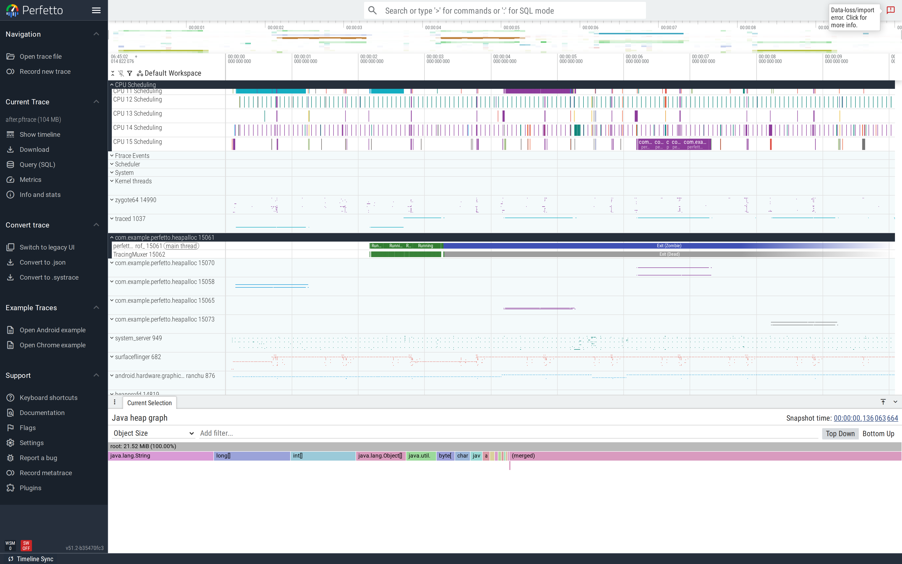

# Java heap: profiling and growth over time

Two perfetto data sources answer different questions about a
Java app's heap:

- **`android.heapprofd` with `heaps: "com.android.art"`** — the
  *Java heap profile*. Samples allocations as they happen; gives
  you a flamegraph rooted at the Java method that allocated each
  byte. Use it to answer "what code is allocating?".
- **`android.java_hprof` with `continuous_dump_config`** — Java
  heap *dumps*. Captures a full retention snapshot every N
  milliseconds; comparing snapshots shows growth over time. Use
  it to answer "what objects are growing?" and (with the
  [Heap Dump Explorer](/docs/visualization/heap-dump-explorer.md))
  "what's keeping each object alive?".

This tutorial uses both. The trace config enables them together
so a single capture answers either question.

This is part of the
[Android performance tutorials](perf-tutorial-series.md) series.

## Capture

Both data sources, one config:

```
data_sources {
  config {
    name: "android.java_hprof"
    java_hprof_config {
      process_cmdline: "com.example.perfetto.heapalloc"
      continuous_dump_config { dump_phase_ms: 2000 dump_interval_ms: 2000 }
    }
  }
}
data_sources {
  config {
    name: "android.heapprofd"
    heapprofd_config {
      sampling_interval_bytes: 4096
      pid: <PID>                                # set at capture time
      heaps: "com.android.art"                  # ART = Java heap
      continuous_dump_config { dump_phase_ms: 1000 dump_interval_ms: 1000 }
    }
  }
}
```

Full config:
[`trace-configs/heapalloc.cfg`](https://github.com/fiveapplesonthetable/perfetto/tree/perf-tutorials-artifacts/java-heap-alloc/trace-configs/heapalloc.cfg).

The reference upstream configs are
[`test/configs/java_hprof.cfg`](https://github.com/google/perfetto/blob/main/test/configs/java_hprof.cfg)
and
[`test/configs/heapprofd.cfg`](https://github.com/google/perfetto/blob/main/test/configs/heapprofd.cfg).

```bash
$ adb shell am start -n com.example.perfetto.heapalloc/.HeapAllocActivity
$ sleep 4
$ PID=$(adb shell pidof com.example.perfetto.heapalloc)
$ sed "s/pid: 0/pid: $PID/" trace-configs/heapalloc.cfg > /tmp/jhp.cfg
$ adb push /tmp/jhp.cfg /data/local/tmp/jhp.cfg
$ adb shell perfetto --txt -c /data/local/tmp/jhp.cfg -o /data/local/tmp/heap.pftrace
$ adb pull /data/local/tmp/heap.pftrace
```

Both data sources need Android 12+. `android.heapprofd` with
`heaps: "com.android.art"` may not capture Java samples on every
device — Cuttlefish is occasionally flaky. The `java_hprof`
side is reliable wherever the runtime supports heap dumps.

## Case study: a hot path that allocates a fresh buffer per tick

Every tick, the buggy demo allocates 1,024 fresh 4 KiB byte[]
objects (~4 MiB) and discards them:

```java
for (int i = 0; i < 1024; i++) {
    byte[] b = new byte[4096];                   // fresh alloc
    b[0] = (byte) i;
}
```

12 ticks = ~50 MiB of short-lived garbage attributed to
`onTick`. The fixed version preallocates the array of buffers
once at class load and reuses them on every tick — the per-tick
allocation rate is zero.

### Find it: heap profile (allocation flamegraph)

When the heap profile data source captures cleanly, the bottom
panel shows a flamegraph rooted at the allocating Java method.
On a real device the buggy demo's flamegraph is dominated by
`HeapAllocActivity$1.run -> byte[]`; the fixed demo's is empty.

```sql
-- Per-snapshot total allocated bytes (heapprofd's continuous dump).
SELECT graph_sample_ts/1e9 AS sec, SUM(size)/1e6 AS allocated_mb
FROM heap_profile_allocation
WHERE upid = (SELECT upid FROM process WHERE name = 'com.example.perfetto.heapalloc')
GROUP BY graph_sample_ts ORDER BY sec;
```

### Find it: heap dump (retention growth)

When you want to know what's *currently on the heap* across
time — not just allocation rate — use the multi-snapshot heap
dump. Each snapshot is a full retention graph queryable via
`heap_graph_object`:

```sql
SELECT graph_sample_ts/1e9       AS sec,
       COUNT(*)                  AS objects,
       SUM(self_size) / 1e6      AS reachable_mb
FROM heap_graph_object
WHERE upid = (SELECT upid FROM process WHERE name = 'com.example.perfetto.heapalloc')
GROUP BY graph_sample_ts ORDER BY sec;
```

Each diamond on the **Heap Profile** track in the UI is one
snapshot; click any diamond to load that snapshot's heap into
the bottom panel. The flamegraph shown is the heap *composition*
(which classes own how many bytes), not allocation flow.


To compare snapshots and find what's *growing* between them
(what's getting added but not collected), open the trace in the
[Heap Dump Explorer](/docs/visualization/heap-dump-explorer.md)
and use its Classes tab on each snapshot.

### Fix

For the per-tick allocation, allocate once and reuse:

```java
private static final byte[][] REUSED;
static {
    REUSED = new byte[1024][];
    for (int i = 0; i < REUSED.length; i++) REUSED[i] = new byte[4096];
}

// per-tick: read REUSED[i], no allocation.
```

For larger Java structures: prefer primitive collections
(`IntArray`, `androidx.collection.LongSparseArray`) over the
boxed equivalents.

### Verify

After-trace, the heap profile flamegraph (when it captures) is
empty for the demo's onTick callsite. The multi-snapshot heap
dump shows comparable retention to before (the static `REUSED`
array now holds the buffers permanently — that's the trade
of preallocation), but the *delta* between successive snapshots
is near zero rather than growing:



The single-number scorecard depends on the question:

- **Allocation rate** (heap profile): total bytes from
  `heap_profile_allocation` attributed to your callsite.
- **Retention growth** (heap dump): the slope of `SUM(self_size)`
  across snapshots, restricted to your process.

## When to reach for which

| Question | Data source | UI view |
|---|---|---|
| "Where is my code allocating?" | `heapprofd` + `heaps: "com.android.art"` | Java heap samples flamegraph |
| "What's growing on the heap?" | `java_hprof` + `continuous_dump_config` | Multiple Heap Profile diamonds |
| "What's keeping object X alive?" | `java_hprof` (single snapshot) | [Heap Dump Explorer](/docs/visualization/heap-dump-explorer.md) |

## Second pattern: autoboxing in a tight numeric loop

`List<Long>` instead of `LongArray` allocates a fresh `Long` box
per add. The heap profile's flamegraph shows
`Integer.valueOf` / `Long.valueOf` dominating; the multi-snapshot
heap dump shows `java.lang.Long` count rising linearly.
Different views, same diagnosis. Fix: switch to primitive
collections.

## See also

- [Heap Dump Explorer](/docs/visualization/heap-dump-explorer.md)
  — single-snapshot retention analysis.
- [GC pauses](gc-pauses.md) — runtime consequence of high
  allocation rate.
- [Native heap leaks](native-heap.md) — same `heapprofd` data
  source, but for malloc/free instead of Java.
- Repro artifacts:
  <https://github.com/fiveapplesonthetable/perfetto/tree/perf-tutorials-artifacts/java-heap-alloc>
