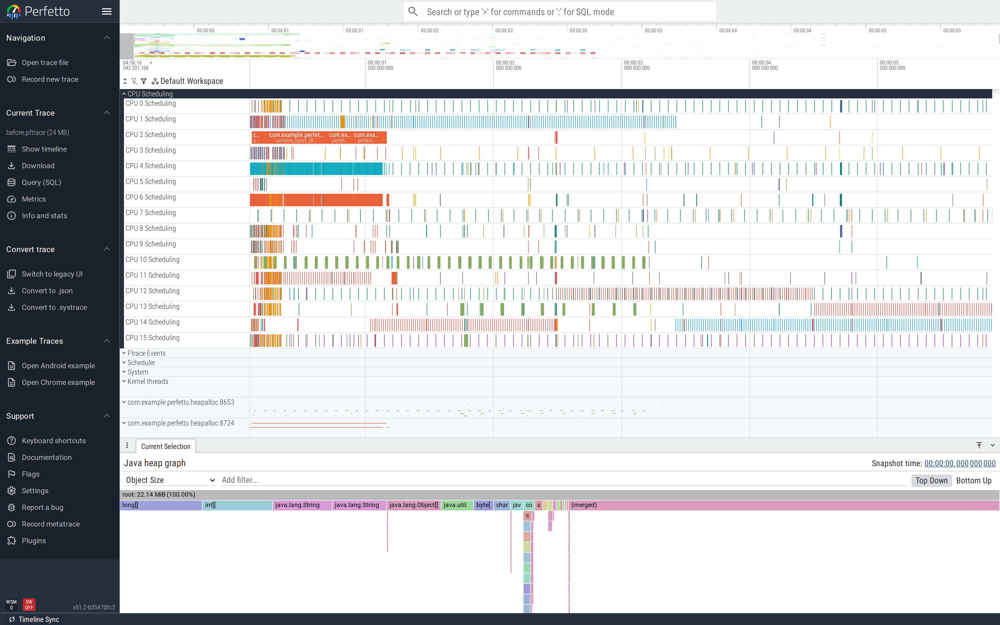
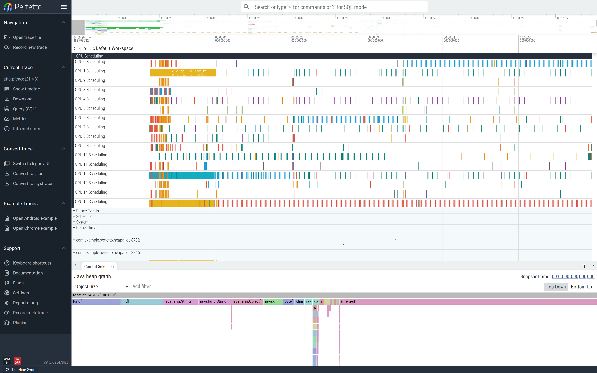

# Java heap allocations

When a hot path allocates short-lived objects every iteration,
the cost shows up two ways: the path itself takes longer (the
allocation isn't free), and the GC runs more often (so other
threads pay too). The
[Java heap sampler](/docs/data-sources/native-heap-profiler.md#java-heap-sampling)
flame­graph shows what the allocations *are*; this tutorial shows
the trace-side view of the *consequence*.

This is part of the
[Android performance tutorials](perf-tutorial-series.md) series.

## Capture

Combine the standard atrace bundle with the Java heap sampler:

```
atrace_categories: "dalvik"  "view"  "sched"
atrace_apps: "com.example.perfetto.heapalloc"

data_sources: {
  config {
    name: "android.java_hprof"
    java_hprof_config {
      process_cmdline: "com.example.perfetto.heapalloc"
      continuous_dump_config {
        dump_phase_ms: 1000
        dump_interval_ms: 0
      }
    }
  }
}
```

Full config:
[`trace-configs/heapalloc.cfg`](https://github.com/fiveapplesonthetable/perfetto/tree/perf-tutorials-artifacts/java-heap-alloc/trace-configs/heapalloc.cfg).

## Case study: rebuild the result list per keystroke

A search box rebuilds its results on every `onTextChanged`. The
buggy version allocates a fresh `ArrayList`, formats every entry
into a fresh `String`, and runs the substring filter against
every formatted entry — even ones that obviously won't match:

```java
ArrayList<String> hits = new ArrayList<>();
for (int i = 0; i < 5000; i++) {
    String word = CORPUS[i % CORPUS.length];
    String formatted = "result " + i + ": " + word + " (q=" + q + ")";  // alloc
    if (formatted.contains(prefix)) hits.add(formatted);
}
return hits;
```

Each keystroke = one fresh `ArrayList` + 5,000 fresh `String`s.

### Read the trace top-down

The HeapAllocDemo process expanded shows two relevant tracks:
the main thread (running `onTextChanged` slices) and a `Heap
thread pool worker` (running `Background concurrent mark compact
GC` slices). The two are tightly interleaved — every keystroke
triggers a GC shortly after, because each call allocates more
short-lived garbage:



This is the canonical "allocation rate too high" pattern. The
GC's job is to keep up with the allocation rate; the more you
allocate, the more often it runs, the more CPU it competes for
with the work that's allocating in the first place.

### Find it

```sql
SELECT 'count:'||COUNT(*)||' avg_ms:'||(AVG(dur)/1e6)
FROM slice WHERE name='onTextChanged';
SELECT COUNT(*) FROM slice WHERE name LIKE '%GC%' AND name NOT LIKE '%Manager%';
```

Before-trace: **39 calls, 20.9 ms each, 18 GC slices in 6 s.**
The GC slices are visible on the GC thread track and overlap with
`onTextChanged` calls on the main thread — the kind of overlap
that turns into stutter on real devices.

For `what` is allocating, open the
[Heap Dump Explorer](/docs/visualization/heap-dump-explorer.md)
on the captured heap dump and read the Java heap sampler's
flamegraph rooted at `onTextChanged`.


### Fix

Reuse the list and a `StringBuilder`; filter before allocating:

```java
private final ArrayList<String> hits = new ArrayList<>(64);
private final StringBuilder buf = new StringBuilder(64);

private List<String> search(String q) {
    hits.clear();
    String prefix = q.substring(0, Math.min(2, q.length()));
    for (int i = 0; i < 5000; i++) {
        String word = CORPUS[i % CORPUS.length];
        if (!word.contains(prefix) && !prefix.startsWith("q")) continue;
        buf.setLength(0);
        buf.append("result ").append(i).append(": ").append(word)
           .append(" (q=").append(q).append(')');
        hits.add(buf.toString());
    }
    return hits;
}
```

### Verify

After-trace: **39 calls, 12.4 ms each, 15 GC slices.** Every
allocation that doesn't contribute to a result is gone, and the
ones that do come from one reused buffer.


The wide view also shows the GC tracks emptier:



There's a useful diagnostic step that didn't fit in the case
study above: when the allocation rate stays high *after* you
think you've reduced it, run the
[Heap Dump Explorer](/docs/visualization/heap-dump-explorer.md)
on a heap dump captured at the same moment. The flamegraph rooted
at the suspect method tells you exactly which line is still
allocating. Allocation-flamegraph + GC-track-density is the pair
of signals that converges this kind of investigation.

## Second pattern: autoboxing in a tight numeric loop

Replacing `int` with `Integer` in a hot loop allocates a fresh
`Integer` per iteration. The flamegraph rooted at the loop shows
`Integer.valueOf` dominating; the trace shows GC frequency
climbing. Fix: primitive collections (e.g.
`androidx.collection.SparseArrayCompat`, `IntIntMap`).

## See also

- [GC pauses](gc-pauses.md) — when the consequence (the GC) is
  the bug worth filing.
- [Heap Dump Explorer](/docs/visualization/heap-dump-explorer.md)
  — for retained-memory analysis.
- Repro artifacts:
  <https://github.com/fiveapplesonthetable/perfetto/tree/perf-tutorials-artifacts/java-heap-alloc>
