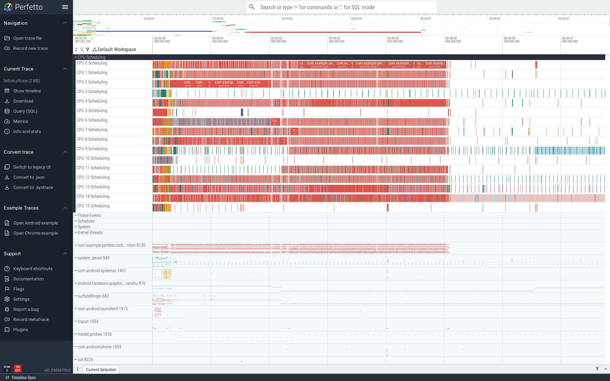
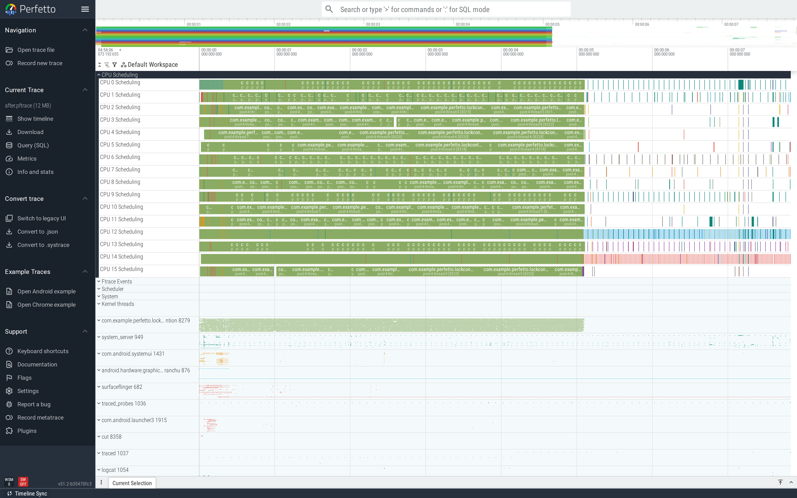

# Lock contention

A `synchronized` block held longer than the work it actually has
to protect is the textbook scalability bug. With 16 threads
contending on one mutex, you get throughput equal to one thread.

This is part of the
[Android performance tutorials](perf-tutorial-series.md) series.

## Capture

```
ftrace_events: "sched/sched_switch"
ftrace_events: "sched/sched_blocked_reason"
atrace_categories: "dalvik"  "sched"
atrace_apps: "com.example.perfetto.lockcontention"
```

The `dalvik` atrace category emits ART's `Lock contention on …`
slices when a thread blocks on a monitor. These are gold.

Full config:
[`trace-configs/lock.cfg`](https://github.com/fiveapplesonthetable/perfetto/tree/perf-tutorials-artifacts/lock-contention/trace-configs/lock.cfg).

## Case study: long critical section

A worker pool computes a hash, then publishes the result. The
naive version holds the mutex for the entire compute:

```java
synchronized (LOCK) {
    long h = state;
    for (int i = 0; i < 200_000; i++) h = h * 1103515245L + 12345L;
    state = h;
}
```

Sixteen workers all behind one mutex doing 5 ms of compute = a
serial pipeline.

### Read the trace top-down

The `LockDemo` process expanded shows the 16 worker threads plus
the framework threads. The naked-eye signal: only one of the
workers is `Running` at any moment; the other 15 sit `Blocked`
for the entire window. Sched tracks make this very visible —
each worker shows green-Running slivers separated by long
red-Blocked stretches:



A pool of N threads on a single mutex is the textbook
serialisation pattern. The CPU cores above are mostly idle —
you're not compute-bound, you're contention-bound.

### Find it

```sql
SELECT 'ops:'||COUNT(*)||' avg_ms:'||(AVG(dur)/1e6)
FROM slice WHERE name='BadCache.compute';
```

Before-trace: **9,630 ops, 6.26 ms each** in a 6 s window — close
to the theoretical max for a single-threaded computation, even
though we have 16 threads. In the UI, look at the worker thread
tracks: most are in the `Blocked` state with `Lock contention on
…` slices, only one is `Running`.


### Fix

Compute outside the lock; publish inside:

```java
long h = state;
for (int i = 0; i < 200_000; i++) h = h * 1103515245L + 12345L;
synchronized (LOCK) { state = h; }
```

The critical section shrank from ~5 ms to a single store.

### Verify

After-trace: **131,192 ops, 0.54 ms each** — **13.6× more
throughput, 11.6× faster per op**. All 16 worker threads are now
`Running` in parallel; lock contention slices drop to ~1.2% of
ops.


The wide view confirms it: all 16 worker threads are `Running`
densely in parallel; the CPU cores above are pegged. You've gone
from compute-on-one-core to compute-on-all-cores with one
structural change to the critical section:



The general lesson: a `synchronized` block whose body is more
than a single store/load is a candidate for shrinking. Move every
read or computation that doesn't depend on shared mutable state
*outside* the lock.

## Second pattern: UI-thread contender

If one of the contending threads is the UI thread, the symptom is
jank rather than throughput loss — the user sees stuttery frames
on every operation that needs the singleton. Same `Lock
contention` slice in the trace, but on the UI thread track.

## See also

- [Frame jank](frame-jank.md) — when the UI thread is the loser.
- [Scheduling blockages](scheduling-blockages.md) — for combined
  lock + scheduler analysis.
- Repro artifacts:
  <https://github.com/fiveapplesonthetable/perfetto/tree/perf-tutorials-artifacts/lock-contention>
