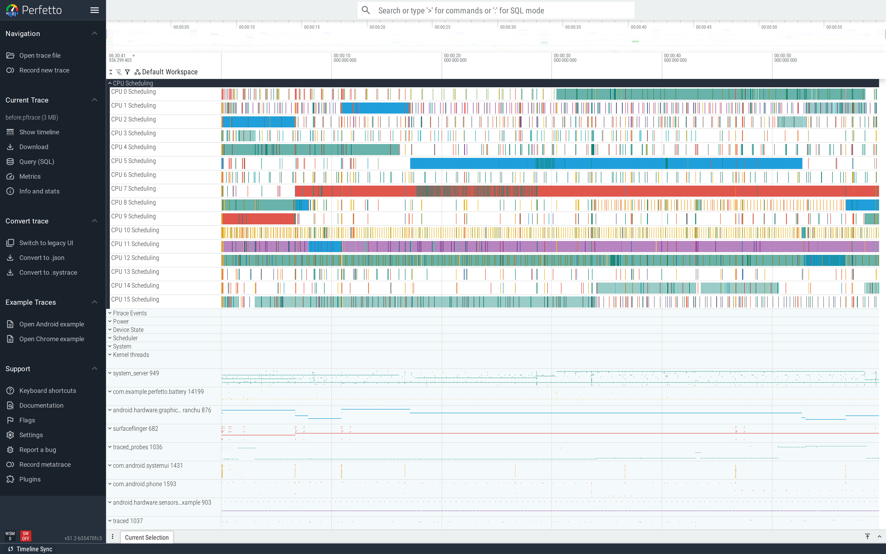
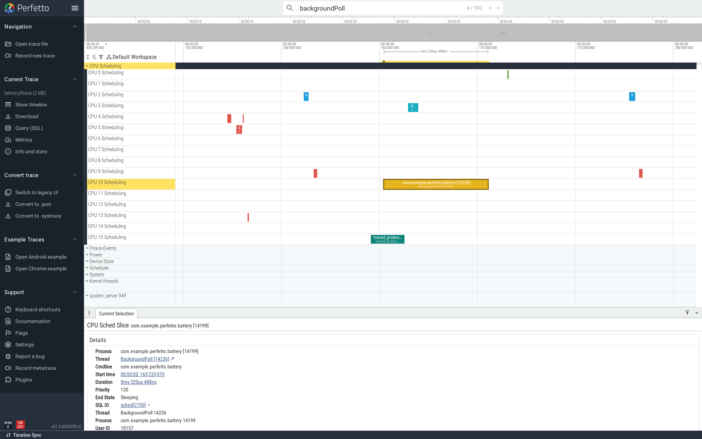
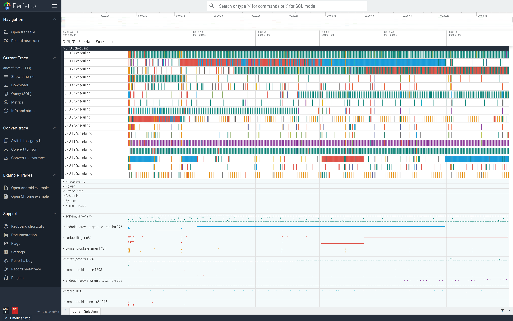

# Long-trace battery investigations

24-hour battery problems can't be caught by the short capture
configs the rest of the tutorials in this series use. Perfetto's
long-trace mode is the right pattern: write the buffer to disk
periodically, capture for hours-to-days, then post-process to
find the wakeups, wakelocks, and CPU activity that the device
should not have been doing.

This is part of the
[Android performance tutorials](perf-tutorial-series.md) series.

## Capture

The reference config is upstream at
[`test/configs/long_trace.cfg`](https://github.com/google/perfetto/blob/main/test/configs/long_trace.cfg).
The two pieces that make it "long":

```
write_into_file: true       # flush to file periodically, don't buffer everything
file_write_period_ms: 2500  # how often (real 24h trace: ~10000)
flush_period_ms: 5000       # commit shared-mem to central buffer
duration_ms: 60000          # demo: 60s; real: 86_400_000 (24h)
```

…plus the data sources that surface battery and idle state:

```
data_sources {
  config {
    name: "android.power"
    android_power_config {
      battery_poll_ms: 500
      collect_power_rails: true
      battery_counters: BATTERY_COUNTER_CAPACITY_PERCENT
      battery_counters: BATTERY_COUNTER_CHARGE
      battery_counters: BATTERY_COUNTER_CURRENT
    }
  }
}

data_sources {
  config {
    name: "linux.ftrace"
    ftrace_config {
      ftrace_events: "power/suspend_resume"
      ftrace_events: "power/cpu_idle"
      ftrace_events: "power/cpu_frequency"
      ftrace_events: "power/wakeup_source_activate"
      ftrace_events: "power/wakeup_source_deactivate"
      ...
    }
  }
}
```

Full tutorial config:
[`trace-configs/long-battery.cfg`](https://github.com/fiveapplesonthetable/perfetto/tree/perf-tutorials-artifacts/long-trace-battery/trace-configs/long-battery.cfg).
For a real 24-hour capture, bump `duration_ms` to 86,400,000,
`file_write_period_ms` to 10,000, and write to a path on
`/data/misc/perfetto-traces` so the trace survives reboots.

## Case study: a background poll that never sleeps

A background `Handler` posts a no-op `Runnable` every 200 ms.
Each tick does ~5 ms of CPU and re-posts itself. Over 24 hours
that's ~430,000 wake events; the kernel never gets to enter Doze
because something in your app keeps poking it.

```java
HandlerThread bg = new HandlerThread("BackgroundPoll"); bg.start();
Handler h = new Handler(bg.getLooper());
Runnable tick = new Runnable() {
    @Override public void run() {
        Trace.beginSection("backgroundPoll");
        try {
            long deadline = System.nanoTime() + 5_000_000;  // 5 ms of CPU
            long x = 0;
            while (System.nanoTime() < deadline) x += System.nanoTime();
        } finally { Trace.endSection(); }
        h.postDelayed(this, 200);                            // forever
    }
};
h.post(tick);
```

### Find it

```sql
-- Count of the demo's poll slices over the trace window.
SELECT COUNT(*) FROM slice WHERE name='backgroundPoll';

-- Wakeup sources during the window.
SELECT COUNT(*) FROM ftrace_event WHERE name='wakeup_source_activate';

-- Battery current draw (μA), if the device exposes a current sensor.
SELECT ts, value FROM counter WHERE name='batt.current_ua' ORDER BY ts;
```

Before-trace (60-second demo): **290 backgroundPoll slices**
in 60 s — 5/sec, no idle gap. In a real 24-hour trace this would
be ~430,000.



Zoom onto a single slice for the per-tick cost:



### Fix

Stop polling. If the work is genuinely periodic, schedule it via
[`WorkManager`](https://developer.android.com/topic/libraries/architecture/workmanager)
at the longest cadence the user-visible behaviour can tolerate
(e.g. every 15 minutes minimum). WorkManager is Doze-aware and
batches wakeups across apps, so the cost is shared.

```java
// In Application.onCreate:
PeriodicWorkRequest req = new PeriodicWorkRequest.Builder(
        PollWorker.class, 15, TimeUnit.MINUTES)
    .setConstraints(new Constraints.Builder()
        .setRequiredNetworkType(NetworkType.CONNECTED)  // only when needed
        .build())
    .build();
WorkManager.getInstance(this).enqueueUniquePeriodicWork(
    "poll", ExistingPeriodicWorkPolicy.KEEP, req);
```

In our demo's case the work isn't needed at all; the fixed
version simply removes the polling Runnable.

### Verify

After-trace: **0 backgroundPoll slices.** The cuttlefish device
still has framework-level wake activity, but nothing from this
app:



The single-number scorecard for "is this app a battery hog?" in
24-hour traces:

```sql
SELECT COUNT(*) AS poll_count
FROM slice
WHERE name = 'backgroundPoll'   -- replace with your app's poll names
  AND track_id IN (
    SELECT id FROM thread_track
    WHERE utid IN (SELECT utid FROM thread WHERE upid =
      (SELECT upid FROM process WHERE name = '<your-pkg>'))
  );
```

Watch this on every release. Any growth is a regression.

## Second pattern: `JobService` that never calls `jobFinished()`

A common variant: a `JobService` whose `onStartJob` returns
`true` (work is async) but never calls `jobFinished(...)`. The
system thinks the job is still running and keeps the device
partially awake. The trace shows the JobScheduler track holding
the job as "running" indefinitely; the app's process keeps an
active reference even though nothing is happening. Fix: always
call `jobFinished(params, false)` on every exit path of the
async work.

## See also

- [Wakelocks](wakelocks.md) — the per-API "leaked acquire"
  variant of the same problem.
- [Battery counters](/docs/data-sources/battery-counters.md) —
  data source reference.
- Repro artifacts:
  <https://github.com/fiveapplesonthetable/perfetto/tree/perf-tutorials-artifacts/long-trace-battery>
