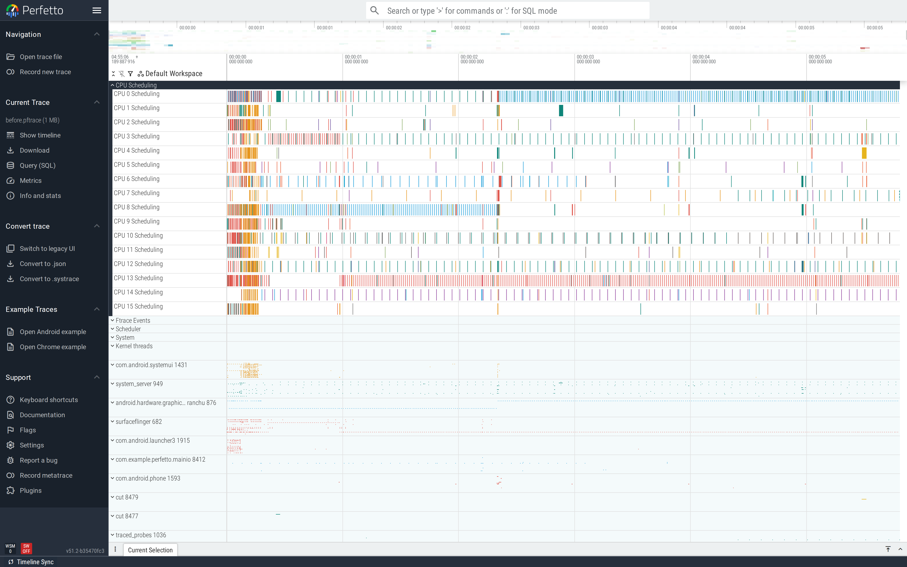
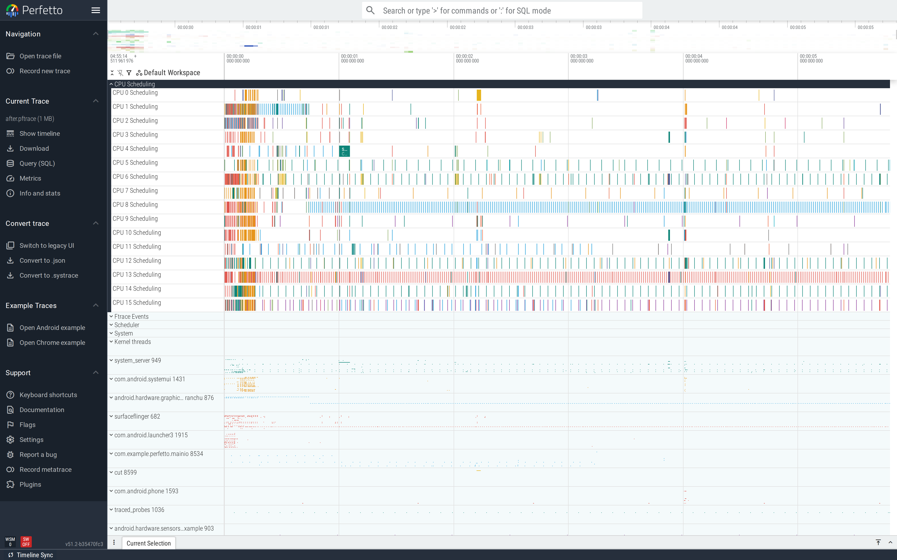

# Main-thread I/O

Synchronous file I/O on the UI thread blocks the thread in
uninterruptible sleep (`D` state) for as long as the kernel takes
to flush. On flash storage that's milliseconds; on a busy disk,
hundreds.

This is part of the
[Android performance tutorials](perf-tutorial-series.md) series.

## Capture

```
ftrace_events: "sched/sched_switch"
ftrace_events: "sched/sched_blocked_reason"
ftrace_events: "f2fs/f2fs_sync_file_enter"
ftrace_events: "f2fs/f2fs_sync_file_exit"
ftrace_events: "ext4/ext4_sync_file_enter"
ftrace_events: "ext4/ext4_sync_file_exit"
atrace_categories: "view"  "sched"  "binder_driver"
atrace_apps: "com.example.perfetto.mainio"
```

Both `f2fs` and `ext4` enter/exit are listed because Android
devices use one or the other depending on the filesystem.

Full config:
[`trace-configs/mainio.cfg`](https://github.com/fiveapplesonthetable/perfetto/tree/perf-tutorials-artifacts/main-thread-io/trace-configs/mainio.cfg).

## Case study: `SharedPreferences.commit()` in a callback

The user toggles a settings tile; the handler writes the change:

```java
prefs.edit().putBoolean("k" + n, n % 2 == 0).commit();
```

`commit()` is synchronous — it writes the prefs XML and `fsync`s
before returning. On the main thread.

### Read the trace top-down

The MainIODemo process expanded shows the main thread carrying
all 50 toggle slices in series — each one a tiny island
separated by a few ms of sleep. Above the main thread, the
filesystem ftrace events (`f2fs_sync_file_enter` /
`_exit`) appear underneath each toggle, exactly aligned:



The pairing is the smoking gun. Wherever a toggle on the main
thread overlaps with an `f2fs_sync_file` event, the main thread
was in uninterruptible sleep for that interval — the user can't
interact with the UI during it.

### Find it

```sql
SELECT 'count:'||COUNT(*)||' avg_ms:'||(AVG(dur)/1e6)
FROM slice WHERE name LIKE 'toggle#%';
```

Before-trace: **39 toggles, 1.58 ms each**. In the UI, expand the
demo's process and find the main thread. Each `toggle#N` slice on
the main thread is the synchronous prefs commit. On a real device
with a slow flash backing, the slice would also contain a long
Uninterruptible Sleep stretch (the main thread blocked in
`f2fs_sync_file`); on cuttlefish's fast virtual storage the cost
manifests as CPU time inside the slice (the framework's commit
path) instead. Either way, the user sees a frame skip.


### Fix

`apply()` schedules the write on a background thread and returns
immediately:

```java
prefs.edit().putBoolean("k" + n, n % 2 == 0).apply();
```

For larger or schema-bearing writes, migrate to
[DataStore](https://developer.android.com/topic/libraries/architecture/datastore),
which is coroutine-first and never blocks the caller.

### Verify

After-trace: **39 toggles, 0.17 ms each — 9.2× faster.** The
main thread no longer enters `D` state inside the toggle slice;
the actual disk write happens later on the background thread that
SharedPreferences manages.


The wide view shows the same 50 toggles on the main thread, but
the `f2fs_sync_file` events are now batched onto a different
thread and timed independently of the toggles:



This is also why `apply()` is the right answer for *most*
SharedPreferences uses, but not all: if you absolutely must know
the write succeeded before your code continues (e.g. a security
config you're about to honour), `commit()` is the only API that
gives you that guarantee — but call it from a background thread.

## Second pattern: synchronous Room query in `onCreate`

A Room DAO call without `Async` / coroutine wrapping does the
same thing — the main thread blocks on the disk read. Often shows
up on cold start: the database open + first query land inside
`bindApplication` and add several hundred milliseconds.

## See also

- [App startup](app-startup.md) — main-thread I/O on cold start
  is a startup-time bug as much as a jank bug.
- [Frame jank](frame-jank.md) — runtime-time main-thread I/O
  shows up as missed frames.
- Repro artifacts:
  <https://github.com/fiveapplesonthetable/perfetto/tree/perf-tutorials-artifacts/main-thread-io>
