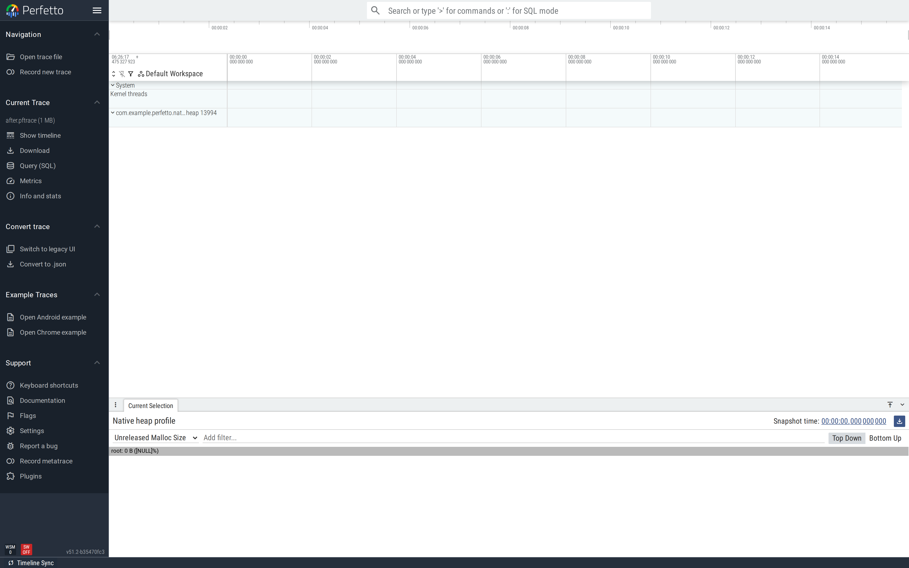

# Native heap leaks (heapprofd)

`heapprofd` is the right data source for "the app's native heap is
growing and we don't know what's allocating it". It hooks
`malloc`/`free` in the target process and emits a snapshot of every
unfreed allocation, with the callstack that produced it, at each
dump interval.

This is part of the
[Android performance tutorials](perf-tutorial-series.md) series.

NOTE: heapprofd requires Android 10+. On user builds the target
must be `profileable` or `debuggable`.

## Capture

The reference config is upstream at
[`test/configs/heapprofd.cfg`](https://github.com/google/perfetto/blob/main/test/configs/heapprofd.cfg).
The relevant slice:

```
data_sources {
  config {
    name: "android.heapprofd"
    heapprofd_config {
      sampling_interval_bytes: 4096
      pid: <PID>                                # or process_cmdline: "<pkg>"
      continuous_dump_config {
        dump_phase_ms: 0
        dump_interval_ms: 1000
      }
    }
  }
}
```

`sampling_interval_bytes: 4096` is the upstream default; smaller
values record more allocations but bloat the trace. `pid:` binds
unambiguously after `am start`; `process_cmdline:` works too but
can race the app's launch.

The full tutorial config is in
[`trace-configs/heapprofd.cfg`](https://github.com/fiveapplesonthetable/perfetto/tree/perf-tutorials-artifacts/native-heap/trace-configs/heapprofd.cfg).

```bash
$ adb shell am start -n com.example.perfetto.nativeheap/.NativeHeapActivity
$ sleep 5                                       # let the leak accumulate
$ PID=$(adb shell pidof com.example.perfetto.nativeheap)
$ adb shell perfetto -o /data/local/tmp/heap.pftrace --txt -c - <<EOF
buffers { size_kb: 102400  fill_policy: RING_BUFFER }
buffers { size_kb: 8192    fill_policy: RING_BUFFER }
data_sources { config { name: "android.heapprofd"
  heapprofd_config { sampling_interval_bytes: 4096 pid: $PID
    continuous_dump_config { dump_phase_ms: 0 dump_interval_ms: 1000 } } } }
data_sources { config { name: "linux.process_stats"
  process_stats_config { scan_all_processes_on_start: true } } }
duration_ms: 20000
EOF
```

For everyday use, `tools/heap_profile -n <pkg>` from the perfetto
repo wraps this in one command.

## Case study: missing `free()` on the success path

A JNI bridge allocates a buffer per call and forgets to free it on
the path that succeeds. This is the textbook native leak — the
native heap grows linearly with usage and the app eventually OOMs.

```cpp
// jni/leak.cc — buggy version
extern "C" JNIEXPORT void JNICALL
Java_com_example_perfetto_nativeheap_NativeHeapActivity_allocate(
        JNIEnv* env, jobject thiz, jint kib) {
    void* p = malloc((size_t)kib * 1024);
    memset(p, 0xAB, (size_t)kib * 1024);    // touch the pages
    g_leaked[g_count++] = p;                 // <-- pinned forever
}
```

Java side calls `allocate(100)` 200 times: 200 × 100 KiB = ~20 MB
of leaked native memory.

### Find it

```sql
-- Net unreleased bytes (alloc + free, where free is recorded as -size).
SELECT (SUM(size) / 1e6) AS net_mb
FROM heap_profile_allocation;

-- Gross alloc volume vs frees.
SELECT (SUM(size) / 1e6) AS alloc_mb, COUNT(*) AS allocs
FROM heap_profile_allocation WHERE size > 0;
```

Before-trace: **17.0 MB allocated, 17.0 MB net unreleased.** Gross
== net means nothing was freed.


The flamegraph is rooted at `__libc_init` and walks up through the
main thread, ART runtime, JNI bridge, and finally the demo's
`allocate` symbol. That last hop names the bug: the only frame
that contributes 100% of unreleased allocations is the JNI's
`allocate` callsite.

The same data is in `heap_profile_allocation`. Each row is one
malloc (positive `size`) or one free (negative `size`); each is
attributed to a callsite in `stack_profile_callsite`. The
flamegraph the UI renders is just an aggregation over those tables
for the selected snapshot.

### Fix

Free the buffer at the end of the call:

```cpp
// jni/leak.cc — fixed version
extern "C" JNIEXPORT void JNICALL
Java_com_example_perfetto_nativeheap_NativeHeapActivity_allocate(
        JNIEnv* env, jobject thiz, jint kib) {
    void* p = malloc((size_t)kib * 1024);
    memset(p, 0xAB, (size_t)kib * 1024);
    free(p);                                 // <-- the fix
}
```

For real code prefer RAII (`std::unique_ptr`, `android::sp`,
JNI's `ScopedLocalRef`) so the free is automatic on every path.

### Verify

After-trace: **17.0 MB allocated, 0.0 MB net unreleased.** Same
allocation rate; the fix added matching frees:



The single-number scorecard for native leaks is
`SELECT SUM(size) / 1e6 FROM heap_profile_allocation` — wired into
a CI heap-profile diff, this catches the next leak before it
ships.

## Second pattern: `ImageReader` buffers not released

A common variant in real apps: `ImageReader.acquireLatestImage()`
without a paired `image.close()`. Each acquired `Image` pins a
backing buffer in HwUI's native heap. The flamegraph in
heapprofd's "Unreleased Malloc Size" view shows the same shape —
one allocation site contributing nearly 100% of unreleased bytes
— except the symbol points at HwUI/Skia code, not at your JNI.
The fix is structural (try/finally release in the consumer
callback); the diagnostic is identical.

## See also

- [Heap Dump Explorer](/docs/visualization/heap-dump-explorer.md)
  — for *Java* heap leaks (different data source: `java_hprof`).
- [Java heap allocations](java-heap-allocations.md) — for
  per-keystroke allocation pressure on the Java side.
- [Native heap profiler](/docs/data-sources/native-heap-profiler.md)
  — the upstream reference for `heapprofd`.
- Repro artifacts:
  <https://github.com/fiveapplesonthetable/perfetto/tree/perf-tutorials-artifacts/native-heap>
