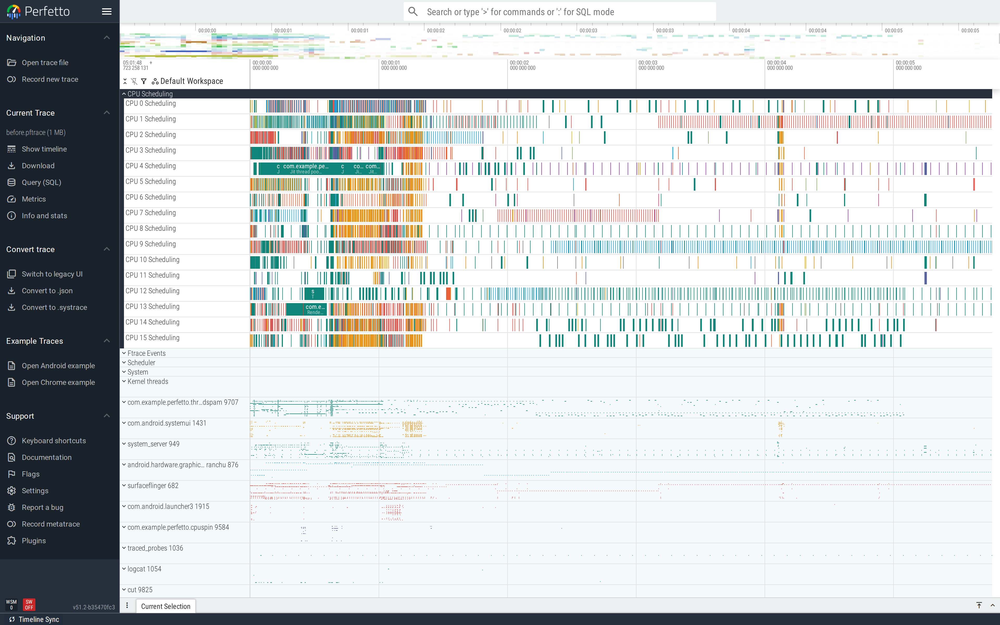
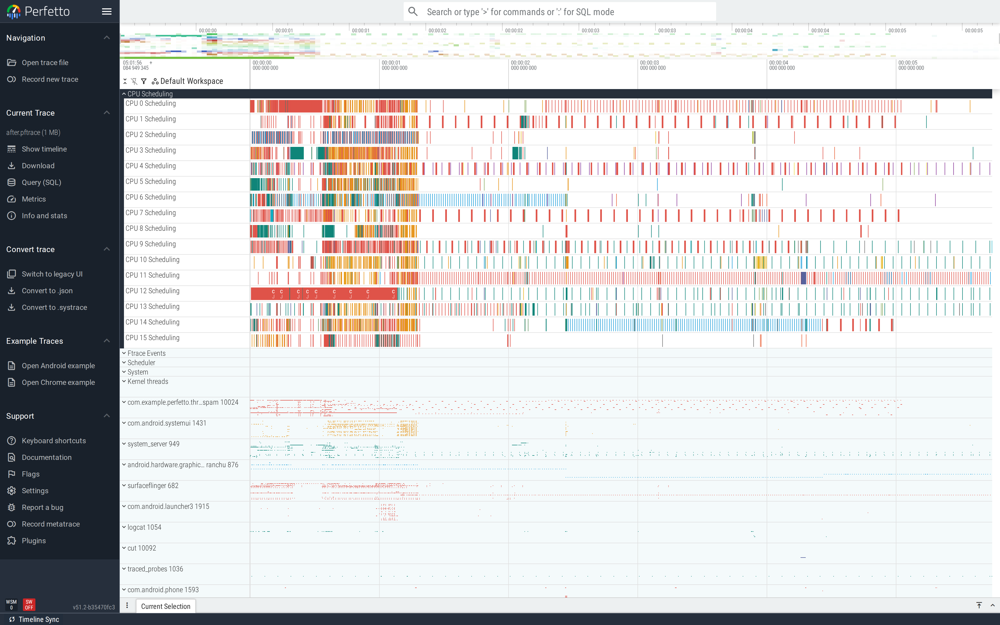

# Short-lived thread spam

`new Thread { … }.start()` per request looks innocuous in code.
In a trace it's a forest of one-shot threads, each created,
running for milliseconds, then dying — and ART pays JIT/init
costs every time.

This is part of the
[Android performance tutorials](perf-tutorial-series.md) series.

## Capture

```
ftrace_events: "task/task_newtask"
ftrace_events: "task/task_rename"
ftrace_events: "sched/sched_switch"
atrace_categories: "sched"
atrace_apps: "com.example.perfetto.threadspam"
```

`task/task_newtask` is the kernel-side thread creation event.
Counting these per process tells you the spawn rate.

Full config:
[`trace-configs/threadspam.cfg`](https://github.com/fiveapplesonthetable/perfetto/tree/perf-tutorials-artifacts/thread-spam/trace-configs/threadspam.cfg).

## Case study: a `Thread` per dispatch

The Activity dispatches 200 short tasks. The buggy version
spawns a thread for each:

```java
new Thread(() -> {
    long deadline = System.nanoTime() + 10_000_000;
    while (System.nanoTime() < deadline) { /* simulated work */ }
}, "Net-" + n).start();
```

200 threads, each running for ~10 ms then exiting.

### Read the trace top-down

The ThreadSpamDemo process expanded is the giveaway. The process
group balloons to hundreds of rows — every `Net-N` thread that
ever ran shows up in the track list, even after it exits. Each
row has one ~10 ms green slice and then nothing:



Two costs are hiding in this picture: the kernel cost of
creating and destroying every thread, and the ART cost of
attaching/detaching them to the runtime (each new thread
allocates per-thread JIT state, profile data, etc.). On a real
device under load, both can become user-visible.

### Find it

```sql
SELECT 'distinct threads in proc:'||COUNT(DISTINCT name)
FROM thread
WHERE upid = (SELECT upid FROM process WHERE name='com.example.perfetto.threadspam');
```

Before-trace: **232 distinct threads in the process** (200
spawned + framework + runtime). In the UI the process expands to
show a wall of one-shot thread tracks; each track has a single
~10 ms `Running` slice and then disappears.


### Fix

Use a fixed-size thread pool. Submit work; the pool reuses the
threads:

```java
private final ExecutorService net = Executors.newFixedThreadPool(4, r -> {
    Thread t = new Thread(r, "Net");
    t.setDaemon(true);
    return t;
});

// at the call site:
net.submit(() -> { /* work */ });
```

For Kotlin: `Dispatchers.IO` (which is itself a thread pool)
gives you the same behaviour.

### Verify

After-trace: **34 distinct threads** (4 pool workers + framework
+ runtime). 7× fewer threads to schedule, no ART thread-init
cost on the hot path. Average dispatch slice drops from 0.37 ms
to 0.16 ms (the difference is the cost of `new Thread().start()`
itself).


The wide view collapses dramatically — instead of a forest of
short-lived threads, you see four steady `Net` worker rows that
share the work:



For most apps, `Dispatchers.IO` (Kotlin coroutines) or
`AppExecutors.io()` (the Architecture Components pattern) is the
right one-liner replacement. For libraries you depend on,
`AppCompatDelegate.setLifecycleAware(true)` and similar APIs
lean on shared system pools rather than per-component ones.

## Second pattern: per-request `OkHttpClient`

Constructing an `OkHttpClient` per request includes its own
internal dispatcher thread pool. A trace from such an app shows
the same pattern — bursts of short-lived `OkHttp …` worker
threads on every network call. Fix: a singleton `OkHttpClient`
shared app-wide.

## See also

- [Lock contention](lock-contention.md) — when the bottleneck is
  inside the pool, not in spawning.
- Repro artifacts:
  <https://github.com/fiveapplesonthetable/perfetto/tree/perf-tutorials-artifacts/thread-spam>
