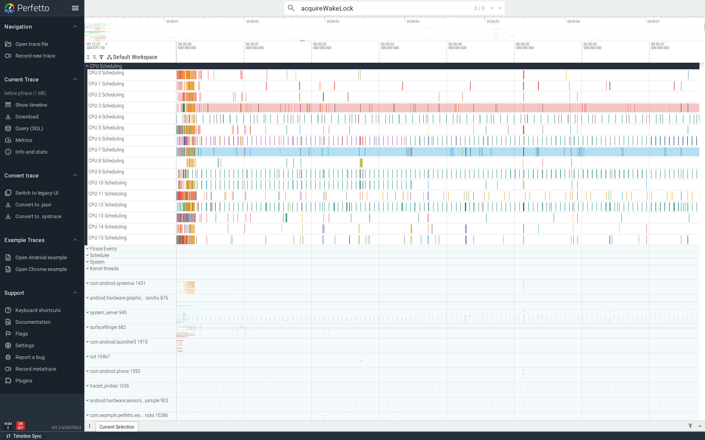
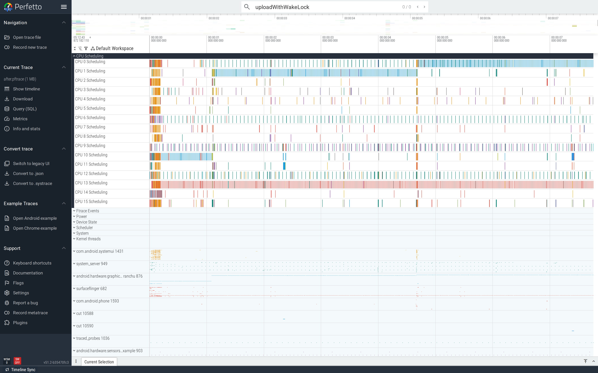
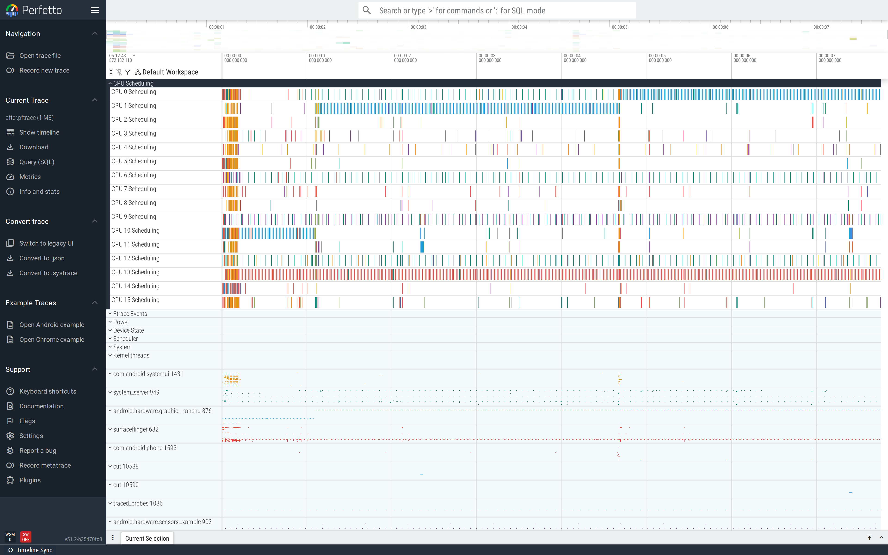

# Wakelocks

A `PowerManager.WakeLock` keeps the CPU awake even with the
screen off. Acquired and never released, it pegs battery drain at
a constant rate the user has no way to escape. The wakelock
ftrace events make leaks trivial to spot — every activate without
a matching deactivate is a smoking gun.

This is part of the
[Android performance tutorials](perf-tutorial-series.md) series.

## Capture

```
ftrace_events: "power/wakeup_source_activate"
ftrace_events: "power/wakeup_source_deactivate"
ftrace_events: "power/suspend_resume"
atrace_categories: "power"  "sched"
atrace_apps: "com.example.perfetto.wakelocks"
```

For 24-hour battery investigations, run this with
`record_android_trace --long-trace` so the trace can sit in
`dropbox` and survive reboots.

Full config:
[`trace-configs/wakelocks.cfg`](https://github.com/fiveapplesonthetable/perfetto/tree/perf-tutorials-artifacts/wakelocks/trace-configs/wakelocks.cfg).

## Case study: acquire-without-release

A "background upload" code path acquires a partial wake lock and
forgets the release on the success branch:

```java
PowerManager pm = (PowerManager) getSystemService(POWER_SERVICE);
PowerManager.WakeLock wl = pm.newWakeLock(PARTIAL_WAKE_LOCK,
                                           "WakelocksDemo:upload");
wl.acquire();
// ... "upload work" ...
// wl.release();   <-- missing on this path
```

### Read the trace top-down

The WakelocksDemo process expanded shows a brief Activity start
on the main thread and then nothing — the app appears to do no
work after `onCreate`. The interesting tracks are at the
*system* level: `system_server` shows a `wakelock` power track
where the named `WakelocksDemo:upload` source has an open
"held" segment with no closing event:


The leak doesn't show up in app-thread tracks because once the
wakelock is acquired, the bug is *the absence of a release*.
The signal moves to the system's power tracks, which is why this
investigation requires `power/wakeup_source_*` ftrace events to
be in the config.

### Find it

Count activations vs deactivations for the leaking source:

```sql
SELECT
  (SELECT COUNT(*) FROM ftrace_event WHERE name='wakeup_source_activate'
   AND EXTRACT_ARG(arg_set_id, 'name') LIKE '%WakelocksDemo%') AS activations,
  (SELECT COUNT(*) FROM ftrace_event WHERE name='wakeup_source_deactivate'
   AND EXTRACT_ARG(arg_set_id, 'name') LIKE '%WakelocksDemo%') AS deactivations;
```

Activate count > deactivate count = a leak — every excess
activate corresponds to a still-held lock. In the UI, look at the
`power.wakeup_source` tracks under `system_server`: the named
source's "held" duration extends to the trace end with no closing
event.



### Fix

Acquire with a hard-cap timeout, release in `finally`, check
`isHeld()`:

```java
PowerManager.WakeLock wl = pm.newWakeLock(PARTIAL_WAKE_LOCK,
                                           "WakelocksDemo:upload");
wl.acquire(2_000L);  // hard cap, prevents catastrophic leak
try {
    // ... upload work ...
} finally {
    if (wl.isHeld()) wl.release();
}
```

For real apps, prefer `WorkManager` for deferrable background
work — it manages wake locks itself and integrates with Doze and
App Standby.

### Verify

After-trace: every `wakeup_source_activate` for the named source
has a matching `wakeup_source_deactivate` within the bounded work
window.



The wide view confirms it. The `Upload` background thread runs
the work; the wakelock activate/release pair brackets exactly
that work. Once the work is done the system is free to
`suspend_resume` and quiesce the device:



The standard production scorecard is
`activate_count - deactivate_count` per `wakeup_source` over a
24-hour window — file as a CI metric, alert on growth. Most
real wakelock leaks compound slowly across days, so a one-shot
trace catches only the rate; the cumulative delta catches the
leak itself.

For 24-hour investigations, the scorecard is
`activate_count - deactivate_count` per `wakeup_source` —
filed-and-tracked weekly in CI catches new leaks before they
ship.

## Second pattern: `JobService` that never calls `jobFinished`

Same shape, different mechanism. A `JobService` whose `onStartJob`
returns `true` (work is async) but never calls `jobFinished(...)`
keeps the system thinking the job is still running indefinitely.
The trace shows the JobScheduler track holding the job as
"running" forever, blocking the device from idling. Fix: always
call `jobFinished(params, false)` on every exit path.

## See also

- [App startup](app-startup.md) — sometimes wakelocks are
  acquired at startup and you only realise after the app has shut
  down.
- Repro artifacts:
  <https://github.com/fiveapplesonthetable/perfetto/tree/perf-tutorials-artifacts/wakelocks>
